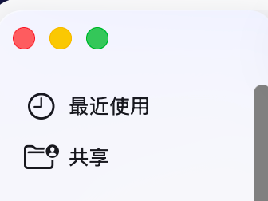

# 胡正阳（Zhengyang Hu）

华南理工大学 计算机科学与工程学院（School of Computer Science and Engineering, South China University of Technology）

2022级 工程博士（Doctor of Engineering Candidate, Class of 2022）

## 研究方向（Research Direction）

* 多变量时序异常检测（Multivariate Time Series Anomaly Detection）

* 集群监控与调度系统（Cluster Monitoring and Scheduling Systems）

